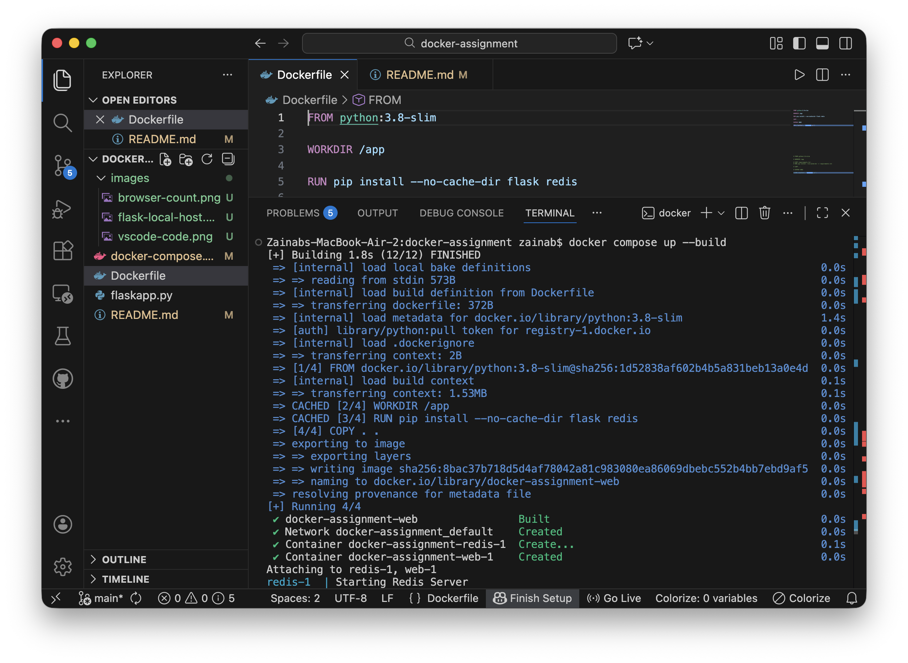
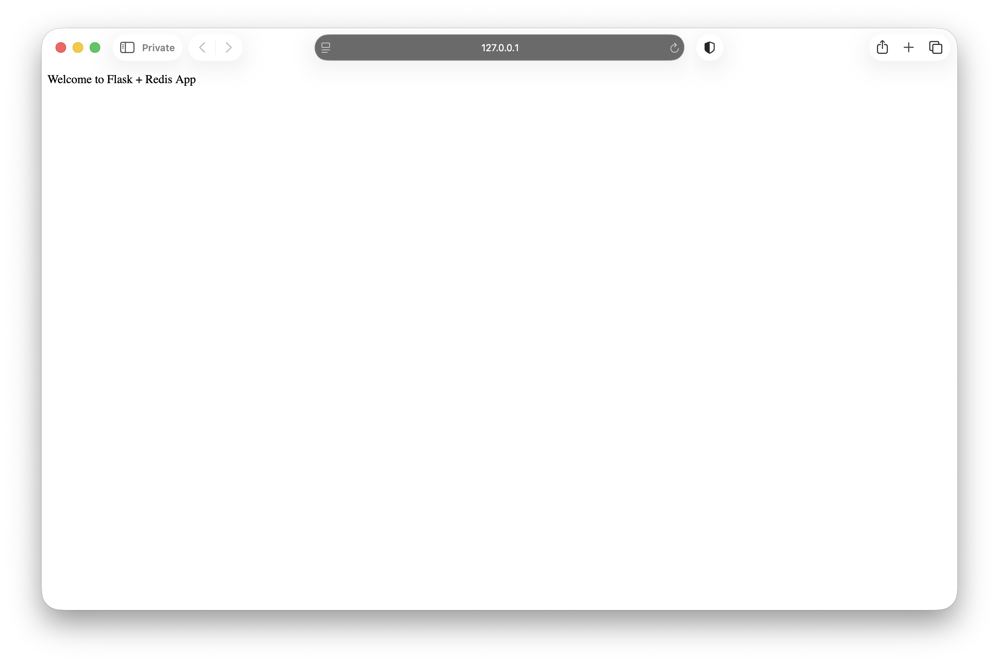
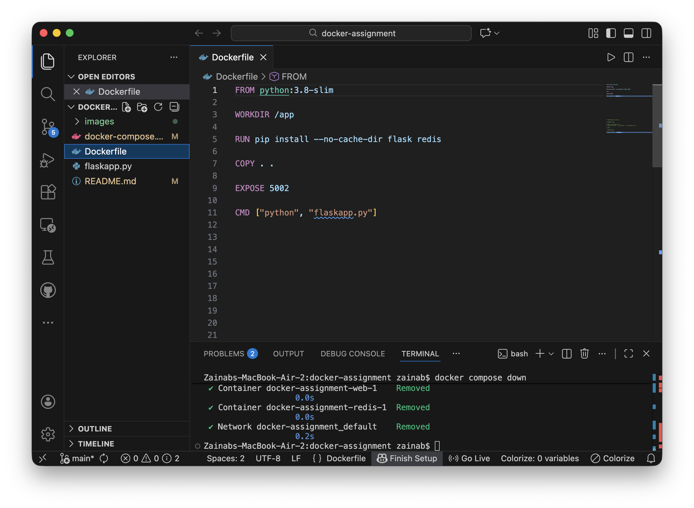

# Docker Flask Redis App
This is a fully containerised Flask web application connected to Redis using Docker and Docker Compose.

## Features:
- Running a Flask app inside Docker
- Dockerised setup
- One command setup using Docker Compose
- Persistent Redis storage

## Technologies Used:
- Python 3.8
- Flask
- Redis
- Docker
- Docker Compose

## Local Setup:

### Clone repository:

```bash
git clone https://github.com<your-username>/docker-flask-redis-app.git
cd docker-flask-redis-app
```

### Build and Start Container:
```bash
docker compose up --build
```



### Open in your browser:

- Home page:
```bash
http://localhost:5002/
```



- Visitor Count:refresh will increase the number each time.
```bash
http://localhost:5002/count
```


### Stopping the App:
- Stop and remove containers:
```bash
docker compose down
```



## Repository Structure:
```bash
.
├── Dockerfile
├── docker-compose.yml
├── flaskapp.py
├── README.md
└── images/
    ├── browser-count.png
    ├── docker-remove.png
    └── dockerbuild.png
    └── flask-local-host.png
```